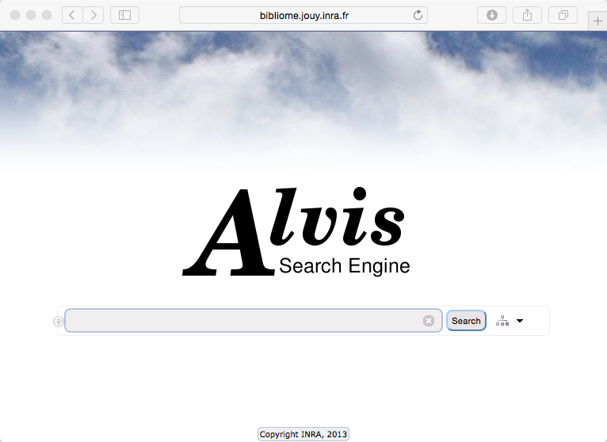
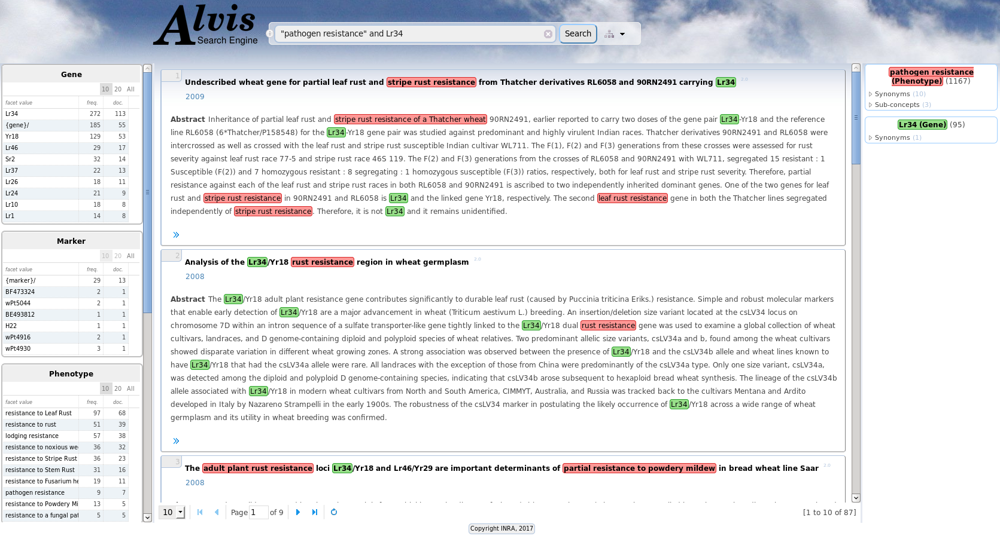
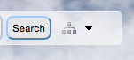
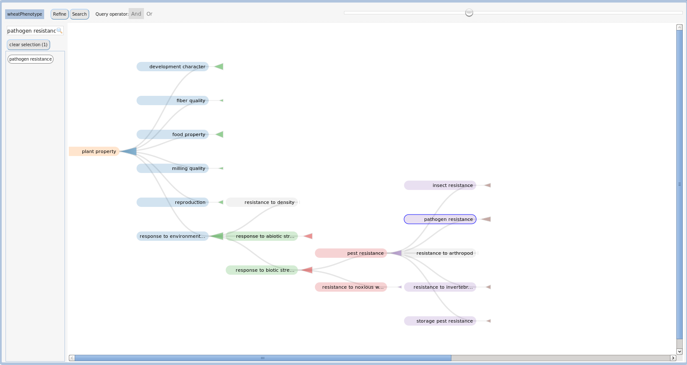
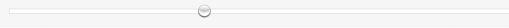
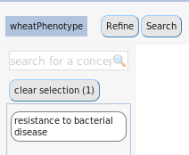

= Wheat Phenotypes

== Application goal
This application offers access to highly relevant articles on wheat in the field of phenomics, i.e. the study of physical and biological traits of organisms in their relation to genetic mutations and environmental change. The user can browse and search papers mentioning phenotypes, but also genes, markers, and taxa that have been identified and normalized beforehand by a text-mining workflow. Unlike classical bibliographic databases that provide information on the general scope of the article, the Wheat Phenotypes application states the presence of the very objects that the user is interested in. In addition, the semantic indexing relieves the user from language variation, providing results in a harmonized way based on common vocabularies and nomenclatures. 

== Application description
This version of the application consists of the automatic recognition and normalization of phenotypes, genes, markers, and wheat-related taxa from scientific abstracts.

The corpus is composed of 3,881 abstracts from 414 journals. 8,996 phenotypes, 10,537 genes, 2,749 markers and 13,015 taxa have been annotated and indexed by the TDM workflow. Taxa and markers are normalized according to identifiers from the URGI database. Phenotypes are normalized according to the Wheat Phenotype Ontology. Genes are normalized according to a in-house lexicon.

The TDM components and the workflow application are deployed on Alvis platform at INRA MaIAGE lab. The end-user can use a semantic search engine to search the extracted information. The Alvis Semantic Information Retrieval engine is a web application, publicly available and usable with any web browser (available at http://bibliome.jouy.inra.fr/demo/wheat/alvisir/webapi/search).

= Wheat Phenotype Search

== User profile
The targeted user of the wheat phenotype search engine is a breeder who wants to access the literature relating to genes that may be involved in a given trait of a specific wheat subspecies. Conversely, the breeder may be interested in any phenotypic-related information on a given gene.

== Architecture of the application
The relevant corpus has been fully pre-processed by the AlvisNLP pipeline and indexed for query through the AlvisIR engine available from any web browser.

== User manual, How-to

=== Launching the application
The URL to run the AlvisIR search engine on Wheat Phenotypes is : 
http://bibliome.jouy.inra.fr/demo/wheat/alvisir/webapi/search

[[img-sunset]]
// .AlvisIR search engine//

Clicking on the “i" at the left of the query field displays the query language.

[[img-sunset]]
//.A click//
image::images/alvisIR_home_Aclick.png[]

=== Query
The query is typed in the query field.

[[img-sunset]]
// .The Query //
image::images/Screenshot-search.png[]

=== Results
The results of the query are displayed in four frames:
* the query interpretation (blue frame)
* the list of hits (pink frame)
* the facets (yellow frame)
* the page number (green frame).

[[img-sunset]]
// .Query Composer Results //

=== Query interpretation
The query is interpreted according to the syntax of the query language. The terms of the query that designate phenotypes with respect to the Wheat Phenotype ontology are interpreted as concepts of this hierarchy.

The query interpretation frame displays the interpretation of query terms as concepts, the list of their synonyms and subconcepts (more specific). The number of occurrences for each term is also displayed. All documents that are indexed by a synonym or a more specific term of the query term are retrieved. 

=== Hits
Each hit represent a document that verify the query constraints. It is composed of:
* the title of the document,
* the publication date, 
* the text of the abstract (whenever available), and 
* the list of the indexed entities (displayed by clicking on the >> symbol)
The taxa, gene, marker, and phenotype names are highlighted. The colour for each entity type corresponds to the colour of the query interpretation frame. 

=== Facets
There is one facet table per index type: Gene, Marker, Phenotype, Taxon, and Year. They give information about the set of retrieved hits. Each table gives the list of values, the total frequency and the number of documents. 10 (by default), 20 or all of them can be displayed. Clicking on any line refines the query: it adds to the query the term in the facet that has been selected.

=== Page number
The number of hits displayed per page can be 10, 20, 30 or 50. 

=== Phenotype selection in the ontology
Clicking on the tree icon at the right of the Search button displays the Wheat Phenotype ontology that indexes the plant traits and a query composer.

[[img-sunset]]
// .WheatPheno //

The ontology window is composed of two parts:
* ontology navigation (pink frame)
* the query composer (yellow frame)

Clicking on the main window in the back closes the ontology window without query composition.

[[img-sunset]]
// .Ontology //

=== Ontology navigation
The levels of the ontology are displayed from the most general to the specific, from left to right. The triangle at the right of a concept name represents the size of the subtree it is the root of. The surface of the triangle is proportional to the depth and the branching factor. Clicking on the triangle opens the subtree.

// .Ontology Navigation //
image::images/Screenshot-onto2.png[]

Zooming is done by using the sliding button on the top of the frame.
[[img-sunset]]
// .Ontology Zoom //

=== Query composer
Clicking on the name of the concept adds it to the query that is displayed as a term stack. The two operators Or or And are available.

[[img-sunset]]
// .Query Composer //

Clicking on Refine button adds the terms to the current query. Clicking on the Search button replaces the current query by the new one.

