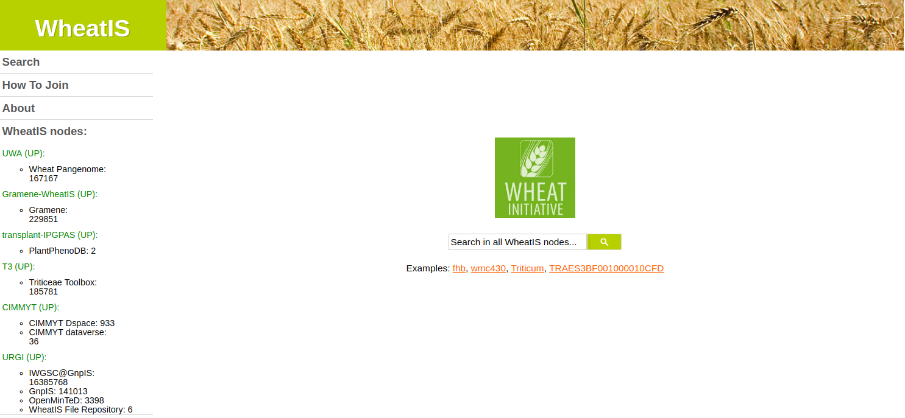
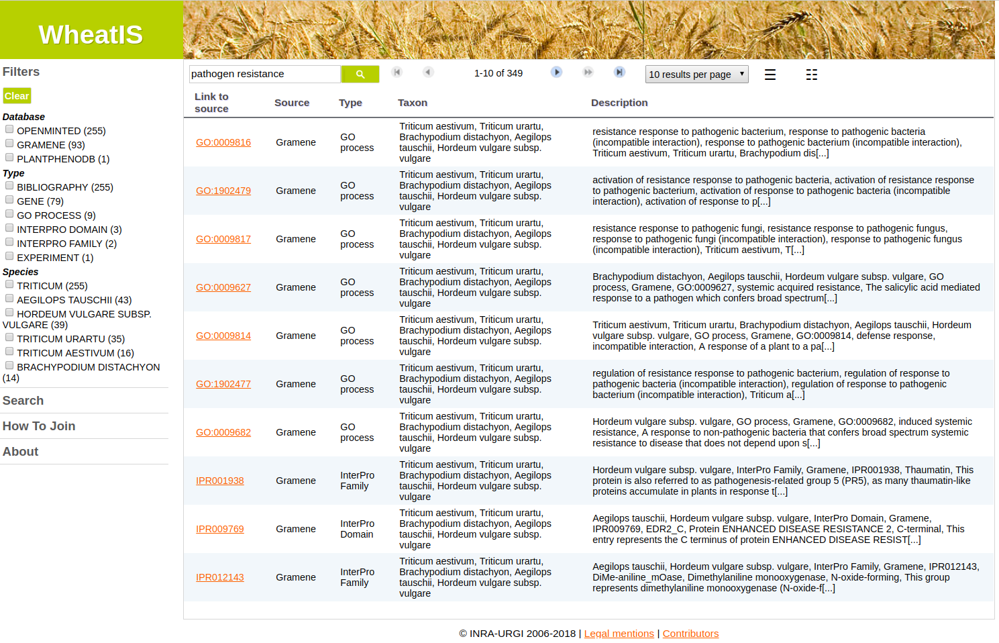
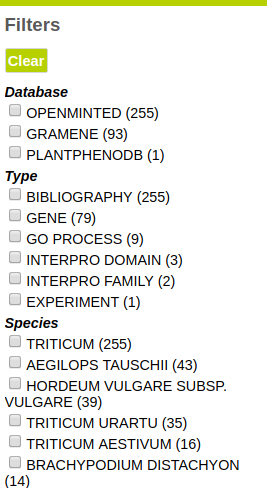
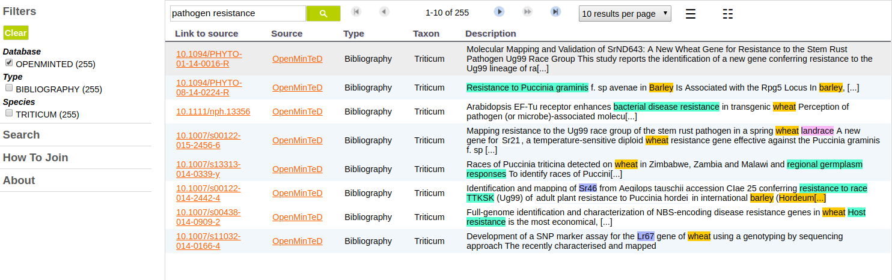

= Wheat

== Application goal

The WheatIS data discovery tool is a search engine that indexes omics data from various sources, and enables a researcher focused on Wheat to cross-check results obtained from field mesures, lab experiments and scientific literature from several source databases, federated into the WheatIS index network. Scientists doing research on wheat obtain results from experiments or field collections and need to cross-check their observations with data from experiments at other scales (whole plant phenotype or genomic data) or from other taxa. Information about phenotypes is written in the literature but does not appear in observation databases. The lack of normalization results in a lack of cross-checking of heterogeneous data. The integration of text-mining annotations to data of heterogeneous types from various sources aims at giving access to the information usually stored in literature but absent from the experiment results databases.

The integration of a TDM (Text and Data Mining) module aims at improving the data discovery, and at assisting users in their bibliography research. The TDM module will provide normalization of unstructured entities and enhanced search capabilities. Here analysis means not only the extraction of the relevant spans of text, but also the normalization or categorization with reference resources (__e.g.__ https://urgi-git.versailles.inra.fr/urgi-is/ontologies/tree/develop/Wheat[WIPO — the Wheat INRA Phenotype Ontology]).

== Application description

This version of the application consists in the automatic recognition and normalization of phenotypes, genes, markers, wheat-related taxa and wheat varieties from scientific publication abstracts.

The corpus is composed of 3,881 abstracts from 414 journals downloaded from the Web of Science website (downloaded in January 2017). 8,996 phenotypes, 10,537 genes, 2,749 markers and 13,015 taxa have been annotated and indexed by the TDM workflow. Taxa and markers are normalized according to identifiers from GnpIS, the URGI database (https://doi.org/10.1093/database/bat058). Phenotypes are normalized according to the WIPO. Genes are normalized according to an in-house lexicon.

The TDM components and the workflow application are deployed on Alvis platform at INRA MaIAGE lab. Results may be searched using the WheatIS data discovery tool, developped by the WheatIS expert working group of the Wheat Initiative led by URGI (INRA, France). 

= WheatIS data discovery tool

== User profile

The user profile of the WheatIS data discovery tool is a biologist whose research is focused on wheat and wanting to cross-check information about wheat genomic, genetic of phenomic data from several databases.

== Architecture of the application

The relevant corpus has been fully pre-processed by an AlvisNLP pipeline and indexed in the WheatIS database (Solr technology). The text-mining annotations can be queried from the WheatIS interface.

== User manual, How-to
=== Launching the application

The WheatIS data discovery tool interface is available at https://urgi.versailles.inra.fr/wheatis[https://urgi.versailles.inra.fr/wheatis].

=== Query

A query passed in the search box will trigger search in over WheatIS index network. A set of examples are provided under the search and a click on them will trigger the query.

[[img-sunset]]
//.Homepage//

=== Results

The results page contains results from the several databases that WheatIS federates.

An example request may be a search for "pathogen resistance".

[[img-sunset]]
//.Results Pathongen resistance//

Facets may be used to filter results from a single source. When filtering the source of results with the value __OpenMinTeD__, all displayed results are text-mining annotations.

[[img-sunset]]
//.Facet OpenMinTeD//

[[img-sunset]]
//.Results OpenMinTeD//

Each result entry correspond to a scientific publication, in which the queried named-entity has been predicted.

For each text-mining result entry, the columns of the table contain the following information:

- ID: the DOI of the publication, which links to the original publication, using a DOI resolver that provides access to an Open Access versions of the publication first
- Source: OpenMinTeD as the annotations have been made using the OpenMinTeD platform. Clicking on the link will redirect to a visualization of the annotations in the text in a semantic search engine (see section below)
- Type: the publication is of type Bibliography
- Taxon: the taxon about which the publication is (as the corpus is focused on Triticum, this taxon is always Triticum)
- Description: this field contains the full text of the publication plus some summary information

=== Visualization of annotations in the AlvisIR semantic search engine

An instance of AlvisIR, a semantic search engine developed in first stage of this use-case is available at the address http://bibliome.jouy.inra.fr/demo/wheat/alvisir/webapi/search

All the abstracts of the corpus and annotations are indexed and can be retrieved by direct use (see <<web_application.adoc#|documentation>> or when redirected to it from the WheatIS web interface.

=== WheatIS federation elements

The WheatIS search portal is part the WheatIS initative. These database instances return the results present in the search results.

 The instances are documented on the following page: http://wheatis.org/WheatIS%20nodes.php
